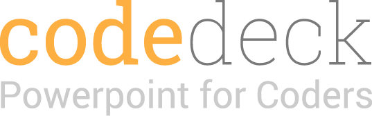

```bash
npm install -g generator-code-deck
```

_Code Deck_ is a [Yeoman generator](http://yeoman.io/) for code based slideshow presentations. It was built because HTML slideshows are awesome, but they take too long to make. With _Code Deck_, your project is automatically set up so you can focus on presenting great content. All you need are three commands:

0. `yo code-deck` to **create your project**.
0. `yo code-deck:section` to **create sections of slides**.
0. `grunt serve` to **develop** and **present**.

Refer to the [RevealJS documentation](https://github.com/hakimel/reveal.js) for slide specific functionality and options.


-------------------------------------------------------


## Prerequisites

Before using _Code Deck_, you need to install a few things if you don't have them already...

0. [Node](http://nodejs.org/): [install](http://nodejs.org/)
0. [Bower](http://bower.io/): `npm install -g bower`.
0. [Yeoman](http://yeoman.io/): `npm install -g yo`.
0. [Grunt](http://gruntjs.com/): `npm install -g grunt-cli`.
0. [Sass](http://sass-lang.com/): `gem install sass`.

If you run into any problems, you may need to use the `sudo` command or [reclaim ownership of the `.npm` directory](http://stackoverflow.com/questions/16151018/npm-throws-error-without-sudo).


-------------------------------------------------------


## Features

- Built with [RevealJS](http://lab.hakim.se/reveal-js/#/) at the core for slide animations and functionality.
- [Grunt](http://gruntjs.com/) tasks for easy development and a shareable `dist` folder.
- [BrowserSync](http://www.browsersync.io/) for style and content live injections during development and realtime collaboration through code examples and inputs during presentation.
- [Ace editor](http://ace.c9.io/) for code examples and live collaboration without needing to switch to an editor.
- Simple [Sass](http://sass-lang.com/) theme that is easily customizable.
- [Handlebars](http://handlebarsjs.com/) partials and templates for clean, DRY code.


-------------------------------------------------------


## Changelog

##### 1.0.0

- Public release


-------------------------------------------------------


Built with ♡ by [@trevordmiller](http://www.trevordmiller.com).
